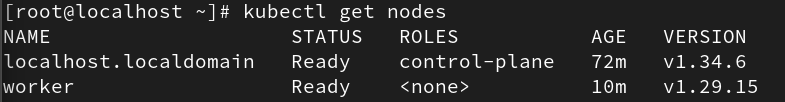
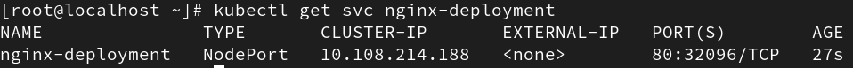

# Lab1

## Kubernetes Cluster Setup Documentation

This document provides a complete, structured guide to setting up a Kubernetes cluster using a Control Plane (Server 1) and a Worker Node (Server 2) on RHEL/CentOS systems. Each step includes both the command and a clear explanation of its purpose.

---

## 1. Control Plane Setup (Server 1)

The Control Plane is responsible for managing the cluster, scheduling workloads, and maintaining the cluster state.

---

### Step 1: Disable Swap

```bash
sudo swapoff -a
sudo sed -i '/ swap / s/^\(.*\)$/#\1/g' /etc/fstab
```

Swap must be disabled because Kubernetes relies on accurate memory reporting. If swap is enabled, the kubelet may behave unpredictably and fail during initialization.

---

### Step 2: Load Kernel Modules

```bash
cat <<EOF | sudo tee /etc/modules-load.d/k8s.conf
overlay
br_netfilter
EOF
```

```bash
sudo modprobe overlay
sudo modprobe br_netfilter
```

These kernel modules are required for container networking:

- `overlay` enables container image layering  
- `br_netfilter` allows iptables to process bridged traffic  

---

### Step 3: Configure Sysctl for Kubernetes

```bash
cat <<EOF | sudo tee /etc/sysctl.d/k8s.conf
net.bridge.bridge-nf-call-iptables = 1
net.bridge.bridge-nf-call-ip6tables = 1
net.ipv4.ip_forward = 1
EOF

sudo sysctl --system
```

These settings ensure proper packet forwarding and allow Kubernetes networking to function correctly across nodes.

---

### Step 4: Configure Repositories

```bash
cat <<EOF | sudo tee /etc/yum.repos.d/local.repo
[BaseOS]
name=Local BaseOS
baseurl=file:///run/media/mohamed/RHEL-9-6-0-BaseOS-x86_64/BaseOS
enabled=1
gpgcheck=0

[AppStream]
name=Local AppStream
baseurl=file:///run/media/mohamed/RHEL-9-6-0-BaseOS-x86_64/AppStream
enabled=1
gpgcheck=0
EOF
```

```bash
cat <<EOF | sudo tee /etc/yum.repos.d/kubernetes.repo
[kubernetes]
name=Kubernetes
baseurl=https://pkgs.k8s.io/core:/stable:/v1.29/rpm/
enabled=1
gpgcheck=1
gpgkey=https://pkgs.k8s.io/core:/stable:/v1.29/rpm/repodata/repomd.xml.key
EOF
```

The local repository is used to bypass Red Hat subscription issues by mounting a local ISO.  
The Kubernetes repository provides the official packages required for installation.

---

### Step 5: Install Required Packages

```bash
sudo yum install -y yum-utils containerd.io kubelet kubeadm kubectl
```

This installs:

- `containerd` as the container runtime  
- `kubelet` to manage node operations  
- `kubeadm` to bootstrap the cluster  
- `kubectl` to manage the cluster  

---

### Step 6: Configure Containerd

```bash
sudo mkdir -p /etc/containerd
containerd config default | sudo tee /etc/containerd/config.toml
sudo sed -i 's/SystemdCgroup = false/SystemdCgroup = true/' /etc/containerd/config.toml

sudo systemctl restart containerd
sudo systemctl enable --now containerd
```

Kubernetes requires the container runtime to use the systemd cgroup driver for proper resource management and stability.

---

### Step 7: Initialize the Cluster

```bash
sudo kubeadm init --pod-network-cidr=10.244.0.0/16
```

This command initializes the Kubernetes Control Plane.  
The `--pod-network-cidr` is required for compatibility with Flannel networking.

---

### Step 8: Configure kubectl Access

```bash
mkdir -p $HOME/.kube
sudo cp -i /etc/kubernetes/admin.conf $HOME/.kube/config
sudo chown $(id -u):$(id -g) $HOME/.kube/config
```

This allows the current user to interact with the cluster using `kubectl`.

---

### Step 9: Deploy Pod Network (Flannel)

```bash
kubectl apply -f https://github.com/flannel-io/flannel/releases/latest/download/kube-flannel.yml
```

Flannel provides networking between Pods across different nodes in the cluster.

---

### Step 10: Configure Firewall

```bash
sudo firewall-cmd --permanent --add-port=6443/tcp
sudo firewall-cmd --permanent --add-port=2379-2380/tcp
sudo firewall-cmd --permanent --add-port=10250/tcp
sudo firewall-cmd --permanent --add-port=10259/tcp
sudo firewall-cmd --permanent --add-port=10257/tcp
sudo firewall-cmd --permanent --add-port=8472/udp
sudo firewall-cmd --reload
```

These ports are required for communication between Kubernetes components and nodes. Without opening them, nodes will fail to join the cluster.

---

## 2. Worker Node Setup (Server 2)

The Worker Node executes workloads and connects to the Control Plane.

---

### Step 1: System Preparation

Repeat the same preparation steps as the Control Plane:

- Disable swap  
- Load kernel modules  
- Configure sysctl  

These ensure the node is compatible with Kubernetes requirements.

---

### Step 2: Configure Repositories

Apply the same repository configuration used on the Control Plane.

---

### Step 3: Install and Configure Components

```bash
sudo yum install -y containerd.io kubelet kubeadm

sudo mkdir -p /etc/containerd
containerd config default | sudo tee /etc/containerd/config.toml
sudo sed -i 's/SystemdCgroup = false/SystemdCgroup = true/' /etc/containerd/config.toml

sudo systemctl restart containerd
sudo systemctl enable --now containerd
sudo systemctl enable --now kubelet
```

Worker nodes do not require `kubectl`, but they must run `kubelet` and `containerd`.

---

### Step 4: Fix Hostname Resolution

```bash
echo "127.0.0.1 worker" | sudo tee -a /etc/hosts
```

This resolves the issue where the system cannot resolve its own hostname during cluster join validation.

---

### Step 5: Join the Cluster

```bash
sudo kubeadm join 192.168.232.129:6443 --token <token> --discovery-token-ca-cert-hash sha256:<hash>
```

This command connects the Worker Node to the Control Plane using a secure token.

---

### Step 6: Enable kubectl (Optional)

```bash
mkdir -p $HOME/.kube
vi $HOME/.kube/config
sudo chown $(id -u):$(id -g) $HOME/.kube/config
```

Copy the `admin.conf` file from the Control Plane to enable cluster management from the Worker Node.

---

## 3. Application Deployment and Validation

---

### Deploy Sample Application

```bash
kubectl create deployment nginx-deployment --image=nginx --replicas=3
```

This creates a deployment with three replicas to test workload distribution.

---

### Expose the Application

```bash
kubectl expose deployment nginx-deployment --type=NodePort --port=80
```

This exposes the application externally using a NodePort service.

---

### Validation

```bash
kubectl get nodes
```

#### Cluster Nodes Status



#### Nginx Service



---

### Verification

- Both nodes should be in `Ready` state  
- The service should be accessible via the assigned NodePort  

This confirms:

- The cluster is functioning correctly  
- Networking is properly configured  
- Workloads are distributed across nodes  

---
