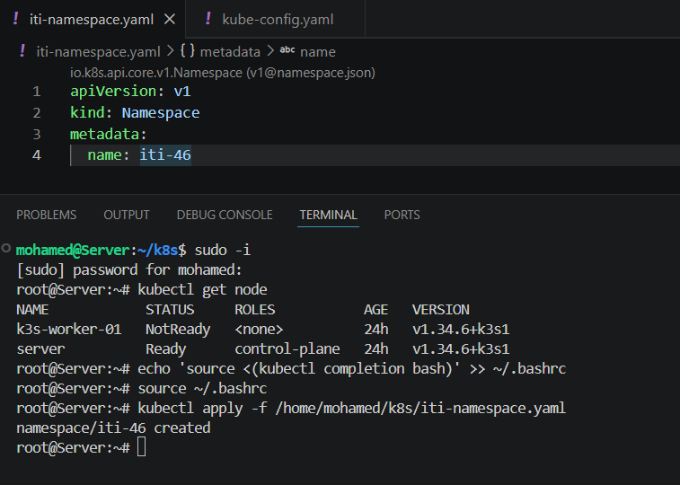
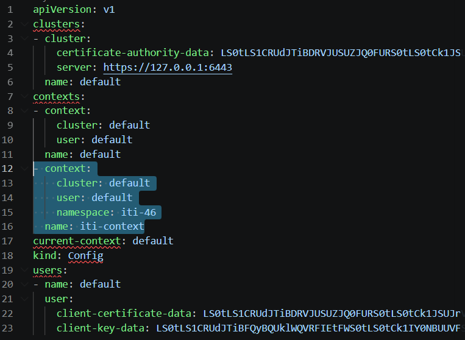
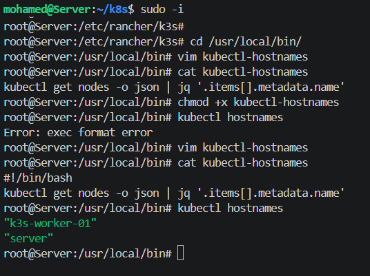
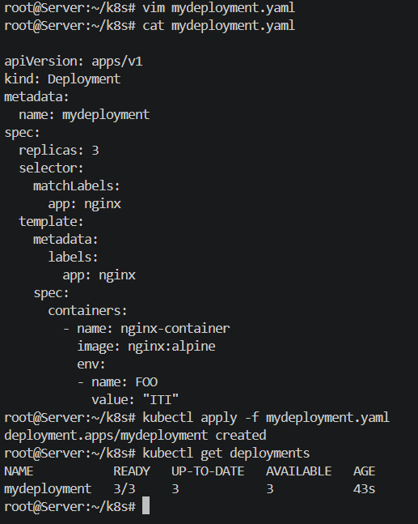

# Kubernetes Lab Solution

---

## Task 1: Kubectl Config 

### a. Create a k3s Cluster (1 server + 1 agent)

Install k3s on the **server (control plane)**:
```bash
curl -sfL https://get.k3s.io | sh -
```

On the **agent (worker)** node, get the token from the server first:
```bash
# On server
cat /var/lib/rancher/k3s/server/node-token
```

Then join the agent:
```bash
# On worker
curl -sfL https://get.k3s.io | K3S_URL=https://<server-ip>:6443 K3S_TOKEN=<token> sh -
```

---

### b. Create a Namespace called `iti-46`

Created a `iti-namespace.yaml` file and applied it to create the namespace in the cluster.



---

### c. Edit kubectl Config — Add `iti-context`

Edited the kubeconfig file to add a new context called `iti-context` that uses the `default` user with the `iti-46` namespace.



> **Note:** The new `iti-context` uses the `default` user and points to the `iti-46` namespace.

---

## Task 2: Kubectl Plugin 

### Create `kubectl hostnames` Plugin

Created a bash script at `/usr/local/bin/kubectl-hostnames` that uses `kubectl` and `jq` to list all node hostnames in the cluster. Made it executable with `chmod +x`.

```bash
#!/bin/bash
kubectl get nodes -o json | jq '.items[].metadata.name'
```



---

## Task 3: Creating Deployments 

### a & b. Deployment YAML with 3 Replicas + ENV Variable `FOO=ITI`

Created `mydeployment.yaml` with:
- **3 replicas** of `nginx:alpine`
- Environment variable `FOO=ITI` injected into each pod

Applied it with `kubectl apply -f mydeployment.yaml` and verified all 3 pods are running with `kubectl get deployments`.


