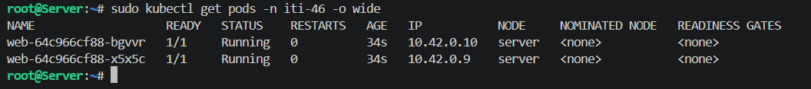
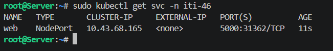
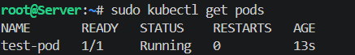
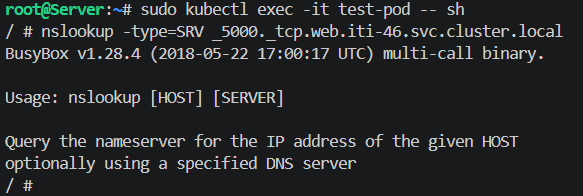
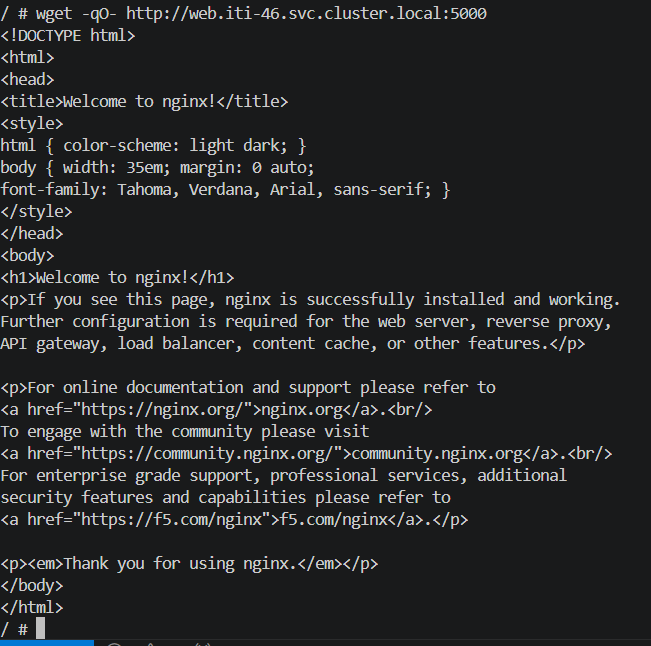
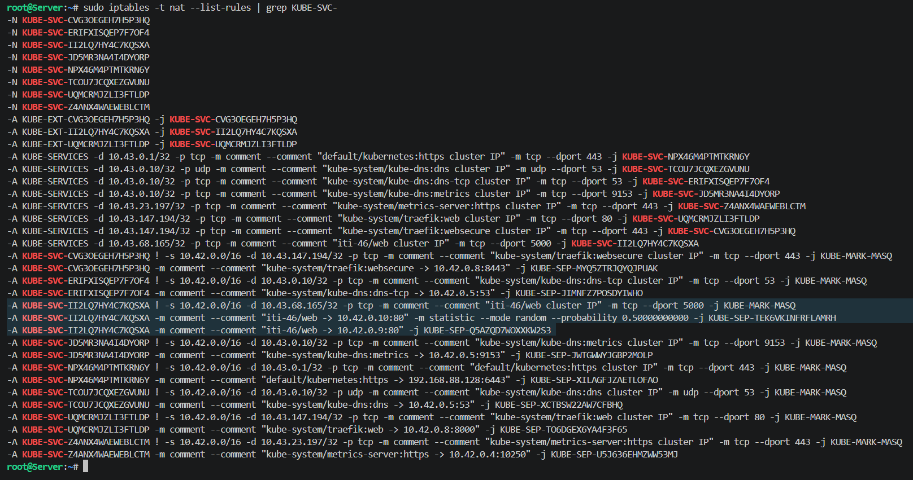
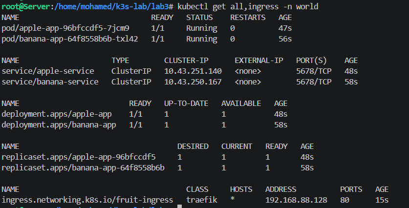
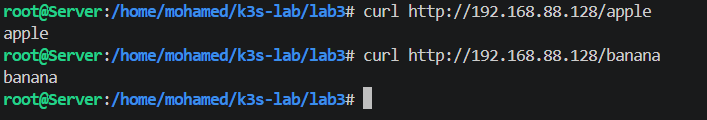

# Kubernetes Lab 3: DNS, Services & Ingress 🚀

---

## Part 1: DNS and Service Discovery 🌐

### 1. Namespace & Deployment Setup

We created a dedicated namespace (`iti-46`) to isolate our resources and deployed an Nginx application with 2 replicas to test load balancing and high availability.

```bash
sudo kubectl create namespace iti-46
sudo kubectl create deployment web --image=nginx --replicas=2 -n iti-46
sudo kubectl get pods -n iti-46 -o wide
```

**Output:**



---

### 2. Service Exposure (NodePort)

The deployment was exposed through a NodePort service to make it reachable within the cluster and from the node's external IP.

```bash
sudo kubectl expose deployment web --port=5000 --target-port=80 --type=NodePort -n iti-46
sudo kubectl get svc -n iti-46
```

**Output:**



---

### 3. Cross-Namespace Communication (Test Pod)

To verify service discovery, we created a temporary test pod in the default namespace.

```bash
sudo kubectl run test-pod --image=busybox:1.28 -- sleep 3600
sudo kubectl get pods
```

**Output:**



---

### 4. Verification of DNS Records (SRV)

We accessed the test pod to query the CoreDNS service directly and confirm port-level discovery via SRV records.

```bash
sudo kubectl exec -it test-pod -- sh
nslookup -type=SRV _5000._tcp.web.iti-46.svc.cluster.local
```

**Output:**



---

### 5. Accessing the Service via FQDN

Still inside the test pod, we verified that HTTP traffic routes correctly using the Fully Qualified Domain Name (FQDN) across namespaces.

```bash
wget -qO- http://web.iti-46.svc.cluster.local:5000
```

**Output:**



---

## Part 2: Network Internals & Load Balancing ⚙️

### Deep Dive: Iptables Rules

Kubernetes uses iptables (via kube-proxy) to manage traffic redirection. We inspected the NAT table rules to observe the load balancing logic (50% probability distribution between the two pod replicas).

```bash
sudo iptables -t nat --list-rules | grep KUBE-SVC-
```

**Output:**


---

## Part 3: Ingress Controller (Path-Based Routing) 🍎🍌

We configured an Ingress controller to manage external access based on HTTP paths. We deployed two separate applications (apple and banana) within a new namespace (`world`).

### 1. Deploying Resources

We applied the YAML manifests containing the Deployments, Services, and the Ingress routing rules.

```bash
sudo kubectl get all,ingress -n world
```

**Output:**



---

### 2. Testing Ingress Routing

Finally, we tested the traffic routing by hitting the Node's IP with the specific paths defined in our Ingress resource.

```bash
curl http://192.168.88.128/apple
curl http://192.168.88.128/banana
```

**Output:**



---
